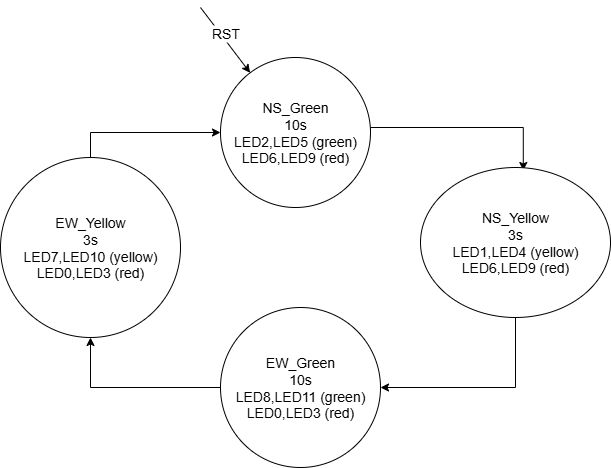

# 🚦 FPGA Traffic Light Controller with Pedestrian Request

This project implements a **Traffic Light Controller FSM** on an FPGA using **SystemVerilog**.  
It simulates real-world traffic signals for **North–South** and **East–West** lanes, and supports a **pedestrian request** input (`ped_req`) which extends green phases when active.

The design is modular and includes:
- A **clock divider** to scale the FPGA input clock to the FSM clock.
- A **Finite State Machine (FSM)** for traffic light sequencing.
- A **top-level module** mapping FSM outputs to board LEDs.
- A **testbench** for simulation and verification.

---

## 🧩 State Diagram

The FSM state diagram:



**State Summary:**

- **NS_Green** — North & South lanes: **Green**
  - Duration: **10 cycles** (extends to **15** cycles if `ped_req = 1`)
- **NS_Yellow** — North & South lanes: **Yellow**
  - Duration: **3 cycles**
- **EW_Green** — East & West lanes: **Green**
  - Duration: **10 cycles** (extends to **15** cycles if `ped_req = 1`)
- **EW_Yellow** — East & West lanes: **Yellow**
  - Duration: **3 cycles**

FSM loops: `NS_Green` → `NS_Yellow` → `EW_Green` → `EW_Yellow` → `NS_Green`

---

## ⏱️ Timing Table

| State       | Normal Duration (cycles) | With Pedestrian Request (cycles) |
|-------------|---------------------------:|----------------------------------:|
| NS_Green    | 10                        | 15                                |
| NS_Yellow   | 3                         | 3                                 |
| EW_Green    | 10                        | 15                                |
| EW_Yellow   | 3                         | 3                                 |
| **Total**   | **26**                    | **36**                            |

> **Note:** If the **FSM clock = 1 Hz**, the total durations are **26 seconds** (normal) and **36 seconds** (with pedestrian request). Adjust `DIVISOR` in the clock divider to change the FSM clock rate.

---

## ⚙️ Module Descriptions

### 1️⃣ Clock Divider (`Clock_divider.sv`)
- Purpose: divide the FPGA input clock to a slower clock used by the FSM.
- Typical default used in code: `DIVISOR = 50_000_000` (converts **50 MHz** → **1 Hz**).  
  If your board uses **100 MHz** (e.g., Nexys A7), set `DIVISOR = 100_000_000`.
- Produces a 50% duty-cycle square wave.

Usage example (from `TOP.sv`):
```verilog
Clock_divider #(DIVISOR) clk_divider (
  .clock_in(FPGA_CLK),
  .rst(rst),
  .clock_out(FSM_CLK)
);
```

---

### 2️⃣ Traffic Light FSM (`FSM_Traffic.sv`)
- Implements a 4-state FSM: `NS_Green`, `NS_Yellow`, `EW_Green`, `EW_Yellow`.
- A small cycle counter controls state durations (see timing table).
- `ped_req` (pedestrian request) extends the active green state by 5 cycles when asserted.
- Outputs three signals per direction: `_<DIR>_G`, `_<DIR>_Y`, `_<DIR>_R` (Green, Yellow, Red).
- Outputs are encoded/driven as separate logic signals (mapped to LEDs at top-level).

---

### 3️⃣ Top-Level Integration (`TOP.sv`)
- Connects the clock divider and FSM, and maps the FSM outputs to the board LEDs.

**LED mapping (as used in `TOP.sv`):**

| LED   | Direction | Color  |
|-------|-----------|--------|
| LED0  | North     | Red    |
| LED1  | North     | Yellow |
| LED2  | North     | Green  |
| LED3  | South     | Red    |
| LED4  | South     | Yellow |
| LED5  | South     | Green  |
| LED6  | East      | Red    |
| LED7  | East      | Yellow |
| LED8  | East      | Green  |
| LED9  | West      | Red    |
| LED10 | West      | Yellow |
| LED11 | West      | Green  |

---

### 4️⃣ Testbench (`tb_TOP.sv`)
- Simulates regular cycles and injected pedestrian requests.
- For faster simulation, a small divisor is used in the testbench (e.g., `DIVISOR = 100`), so the FSM clock toggles quickly.
- Produces a `traffic_tb.vcd` waveform dump for inspection with GTKWave/ModelSim.

Example console monitor output in the testbench (for clarity):
```
Time | Ped | N(R,Y,G) | S(R,Y,G) | E(R,Y,G) | W(R,Y,G)
 100 | 0   | 100      | 100      | 001      | 001
 200 | 0   | 010      | 010      | 001      | 001
 ...
```

---

## 📊 Simulation Results (waveform screenshots)

Waveform screenshots:

- **Basic Traffic Light Cycle:**  
  

- **Full Cycle (No Pedestrian Request):**  
  

- **Full Cycle with Pedestrian Request:**  
  

---

## 🏗️ FPGA Deployment

1. Confirm your FPGA board's input clock (e.g., **100 MHz** for Nexys A7).  
2. Set `DIVISOR` in `TOP.sv` (or `Clock_divider.sv`) so that `FSM clock = desired rate` (e.g., `DIVISOR = 100_000_000` → 1 Hz).  
3. Update your XDC constraints with the physical pins for `LED0`..`LED11`.  
4. Synthesize, implement, and generate the bitstream with your FPGA toolchain (Vivado for Xilinx boards).  
5. Program the FPGA and test the behavior with/without `ped_req` asserted.

---


